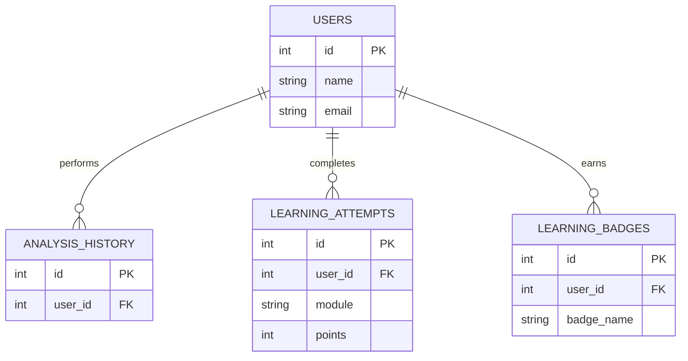

# SkillNova-AI — ER Diagram

```mermaid
erDiagram
    USERS ||--o{ ANALYSIS_HISTORY : performs
    USERS ||--o{ LEARNING_ATTEMPTS : completes
    USERS ||--o{ LEARNING_BADGES : earns

    USERS {
        int id PK
        string name
        string email
    }

    ANALYSIS_HISTORY {
        int id PK
        int user_id FK
    }

    LEARNING_ATTEMPTS {
        int id PK
        int user_id FK
        string module
        int points
    }

    LEARNING_BADGES {
        int id PK
        int user_id FK
        string badge_name
    }
```

